# 严格共同模态轮腿控制算法验证报告

> 生成时间：2026-08-11 00:07:44（Asia/Shanghai）  
> 模型：`source_common.slx`；逐时数据：`../data/*.csv`。

## 结论摘要

- **静态站立：通过。**
- **2° 初始 pitch 恢复：通过。**
- **0→0.5 m/s→0 速度跟踪性能门槛：未通过。**
- **WIPM 非最小相位反向预动作：通过。**

严格共同模态的动力学、NMPC 状态、QP 可行性和左右对称性链路得到验证；但基线速度 MAE 未达到预设 0.1 m/s 门槛，因此不能把整套基线标记为全部通过。本轮只记录结果和参数经验，没有自动调参，也没有修改完整双腿模型。

## 模型和控制结构

验证自由度为基座 $[x_B,z_B,\theta_B]$ 与一个左右完全同步的共同腿变量。控制链为：

`WIPM-LQR wheel planning → 8-state NMPC body wrench → strict common-mode WBC-QP → summed joint torque → Simscape plant`

NMPC 周期 0.010 s、节点数 30、预测时域 0.30 s；静态轮位 $\xi_0=-0.0729389$ m。低摩擦试验只修改共同模态 QP 摩擦锥，不修改 Simscape 接触材料或已编译 NMPC drive coefficient。

## 指标口径

- 轮位幅值统一使用 $\Delta\xi=\xi-\xi_0$；WIPM 理论前馈为 $\Delta\xi_{ideal}=-H a_x^{ref}/g$。
- 通用数值护栏：NMPC status/fault 正常、QP 可行率 >99%、动力学残差无穷范数 <1e-6。
- 速度性能门槛：MAE <0.1 m/s 且 pitch 峰值 <5°；约束扫描使用 MAE <0.15 m/s。
- pitch 整定带为 max(0.1°, 初始角的 2%)。

## 实验 1：静态站立

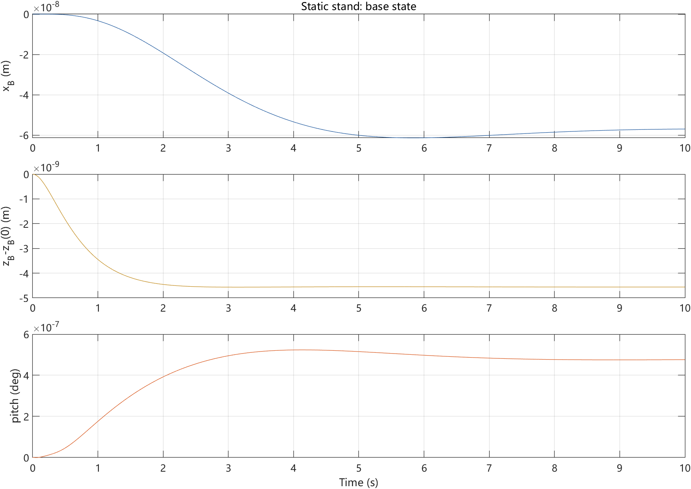

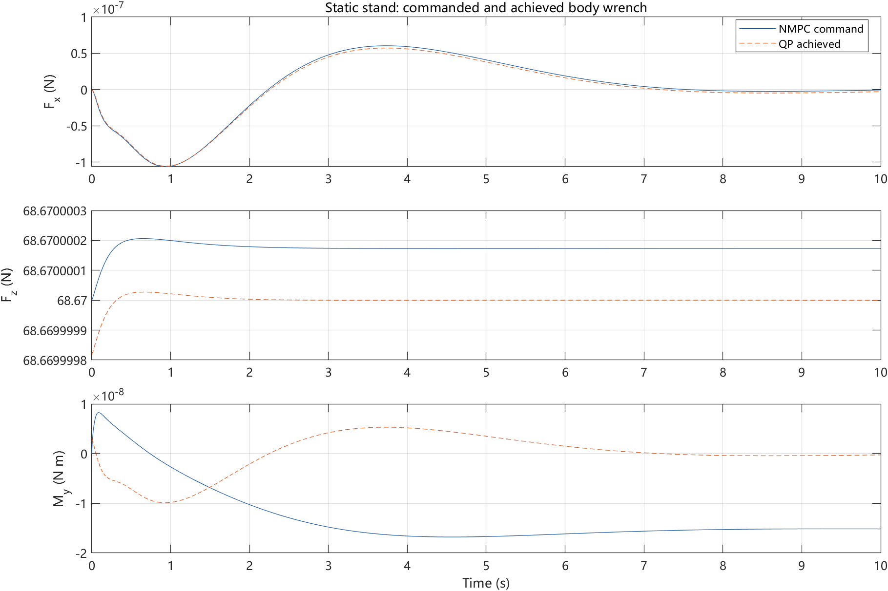

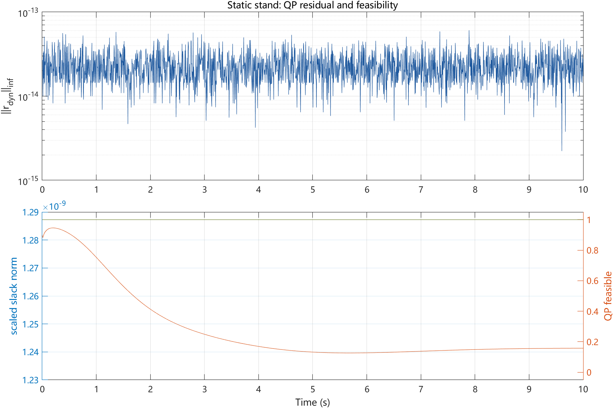

| case | parameter | sim | pass | v MAE (m/s) | peak wheel (m) | peak pitch (deg) | QP feasible | dyn residual |
|---|---|:---:|:---:|---:|---:|---:|---:|---:|
| stand | baseline | yes | yes | 6.573e-09 | 1.819e-09 | 5.236e-07 | 1 | 6.040e-14 |

QP 可行率 100.000%，最大动力学残差 6.040e-14，高度最大漂移 4.566e-09 m；接触总 $F_z$ 与整机重力的相对误差 5.649e-12。静态站立通过。

## 实验 2：初始 pitch 扰动恢复

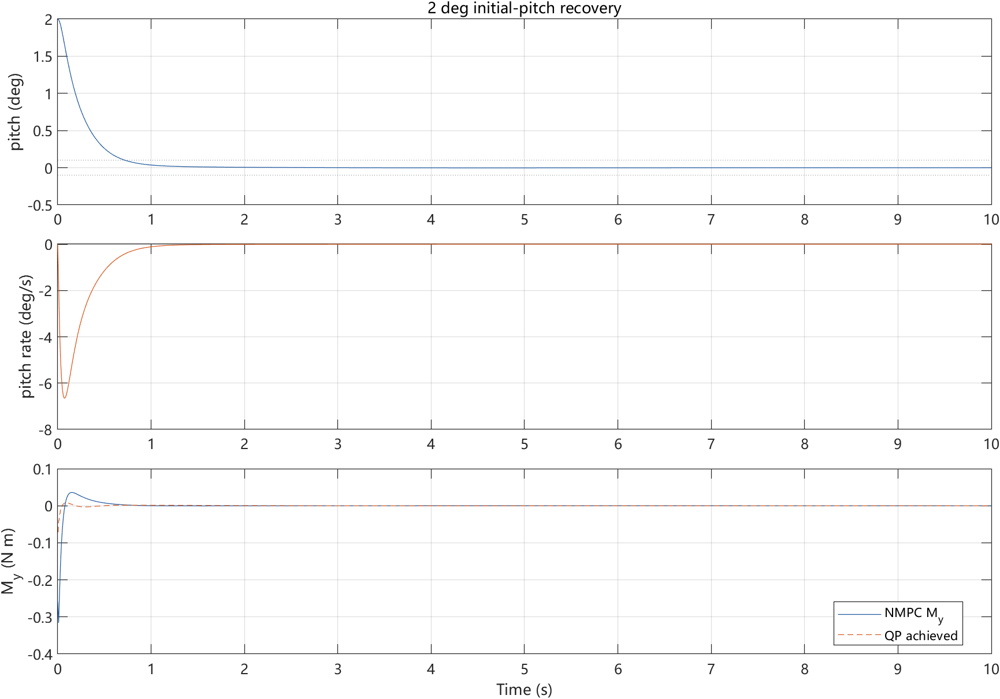

| case | parameter | sim | pass | v MAE (m/s) | peak wheel (m) | peak pitch (deg) | QP feasible | dyn residual |
|---|---|:---:|:---:|---:|---:|---:|---:|---:|
| pitch_2deg | 2 deg initial pitch | yes | yes | 0.0004051 | 0.000352 | 2 | 1 | 6.573e-14 |

初始/最大 pitch 为 2.000°，整定时间 0.725 s，末 1 s 平均稳态误差 0.0001°。

## 实验 3：速度跟踪

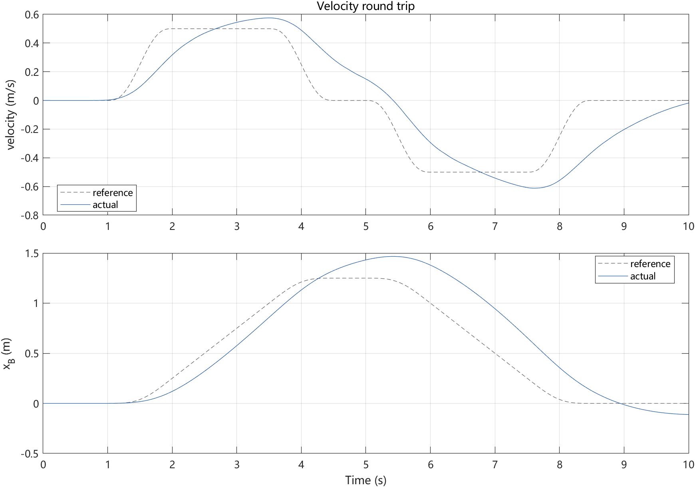

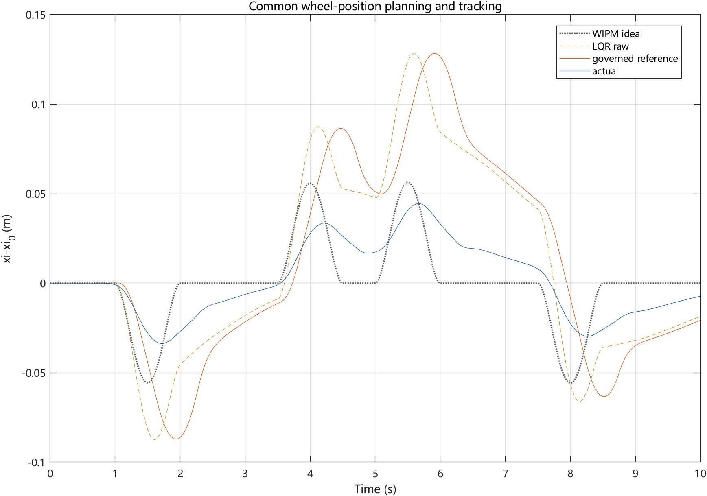

| case | parameter | sim | pass | v MAE (m/s) | peak wheel (m) | peak pitch (deg) | QP feasible | dyn residual |
|---|---|:---:|:---:|---:|---:|---:|---:|---:|
| velocity_baseline | baseline | yes | no | 0.1376 | 0.0445 | 4.352 | 1 | 5.684e-14 |

速度 MAE 0.1376 m/s，轮位峰值 0.0445 m，pitch 峰值 4.352°。QP 全程可行且残差通过，但 MAE 高于 0.1 m/s 门槛，所以性能验收未通过。

## 实验 4：非最小相位轮位规划

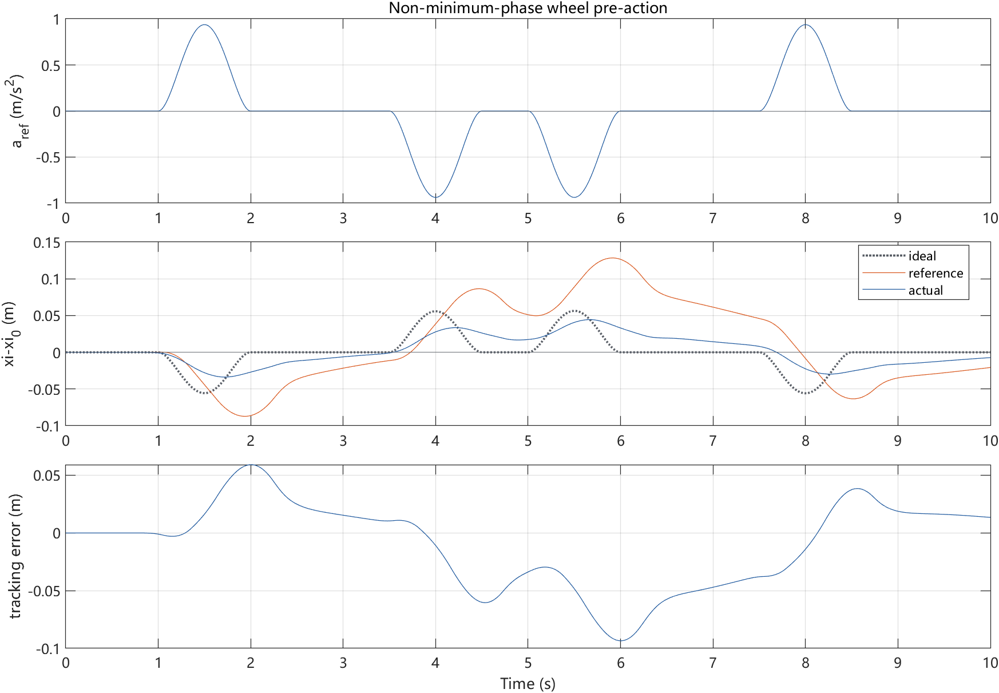

正加速区间的负向比例：理论 100.0%、LQR/governor 参考 77.4%、实际轮位 92.7%；实际/理论负向峰值比为 0.605。正向加速度时轮位先向后，方向验证通过。

## 实验 5：LQR Q/R 敏感性

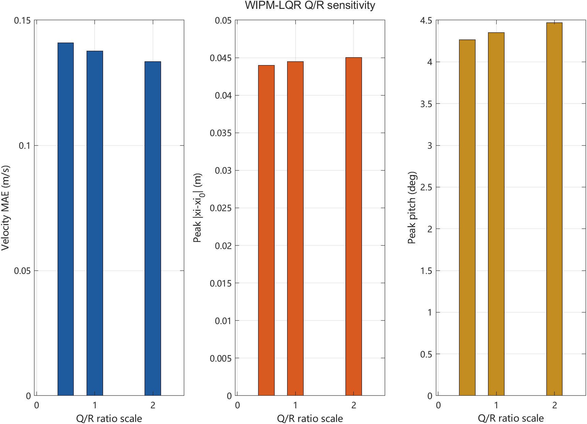

| case | parameter | sim | pass | v MAE (m/s) | peak wheel (m) | peak pitch (deg) | QP feasible | dyn residual |
|---|---|:---:|:---:|---:|---:|---:|---:|---:|
| velocity_baseline | baseline | yes | no | 0.1376 | 0.0445 | 4.352 | 1 | 5.684e-14 |
| lqr_qr_0p5x | Q/R ratio 0.5x | yes | no | 0.1409 | 0.044 | 4.266 | 1 | 5.773e-14 |
| lqr_qr_2x | Q/R ratio 2x | yes | no | 0.1334 | 0.04505 | 4.469 | 1 | 6.306e-14 |

共同缩放 Q、R 不改变 LQR 增益，因此扫描的是有效 Q/R 比 0.5×、1×、2×。2× 在已测点中速度 MAE 最低，但轮位和 pitch 略增；三组均未达到 0.1 m/s MAE 门槛，故这里只记录趋势，不给出通过型推荐。

## 实验 6：NMPC 权重敏感性

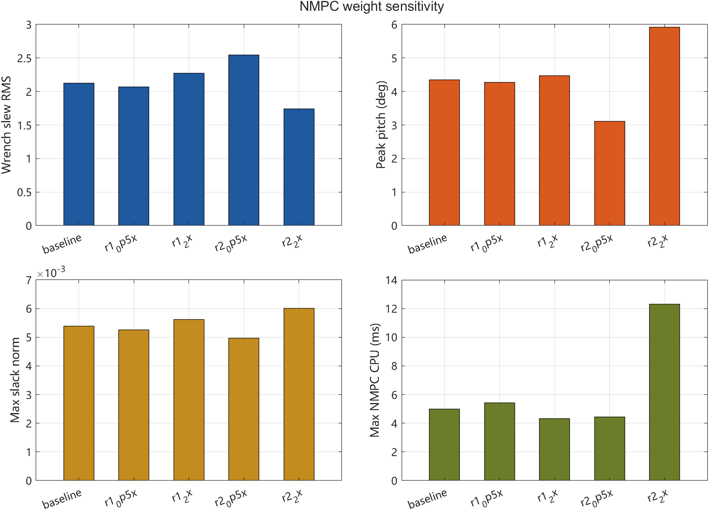

| case | parameter | sim | pass | v MAE (m/s) | peak wheel (m) | peak pitch (deg) | QP feasible | dyn residual |
|---|---|:---:|:---:|---:|---:|---:|---:|---:|
| velocity_baseline | baseline | yes | no | 0.1376 | 0.0445 | 4.352 | 1 | 5.684e-14 |
| nmpc_r1_0p5x | r1_0p5x | yes | no | 0.1347 | 0.04402 | 4.28 | 1 | 6.217e-14 |
| nmpc_r1_2x | r1_2x | yes | no | 0.1426 | 0.04521 | 4.474 | 1 | 5.684e-14 |
| nmpc_r2_0p5x | r2_0p5x | yes | yes | 0.09867 | 0.04574 | 3.114 | 1 | 5.773e-14 |
| nmpc_r2_2x | r2_2x | yes | no | 0.1869 | 0.0429 | 5.917 | 1 | 5.684e-14 |

`R1` 为 wrench 参考偏差惩罚，`R2` 为输入变化惩罚。已测组合中 `R2=0.5×`是唯一达到速度/pitch 门槛的变体（MAE 0.0987 m/s、pitch 3.114°），推荐作为下一轮复核候选；代价是 wrench slew RMS 增至 2.547。`R2=2×` 更平滑，但跟踪和 pitch 明显变差。

## 实验 7：摩擦/力矩约束边界

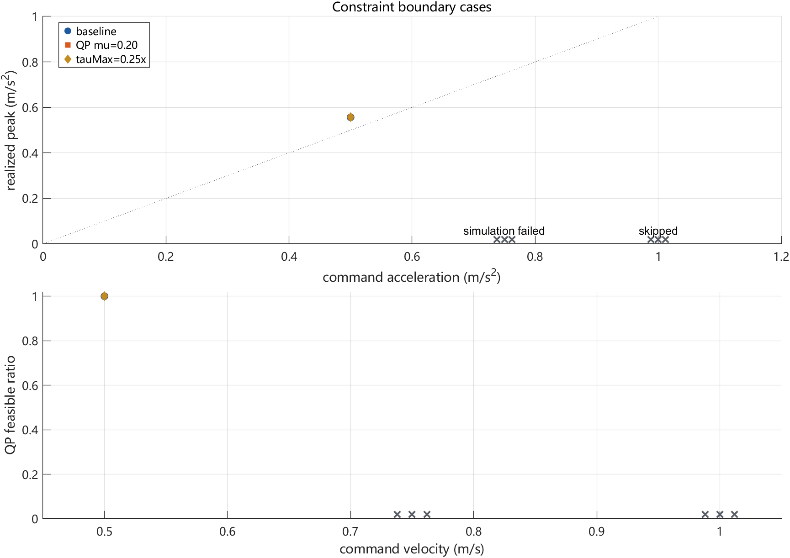

| case | parameter | sim | pass | v MAE (m/s) | peak wheel (m) | peak pitch (deg) | QP feasible | dyn residual |
|---|---|:---:|:---:|---:|---:|---:|---:|---:|
| constraint_baseline_v0p5_a0p5 | baseline | yes | yes | 0.1376 | 0.0445 | 4.352 | 1 | 5.684e-14 |
| constraint_baseline_v0p75_a0p75 | baseline | no | no | NaN | NaN | NaN | NaN | NaN |
| constraint_baseline_v1_a1 | baseline | no | no | NaN | NaN | NaN | NaN | NaN |
| constraint_low_mu_v0p5_a0p5 | QP mu=0.20 | yes | yes | 0.1376 | 0.0445 | 4.352 | 1 | 6.306e-14 |
| constraint_low_mu_v0p75_a0p75 | QP mu=0.20 | no | no | NaN | NaN | NaN | NaN | NaN |
| constraint_low_mu_v1_a1 | QP mu=0.20 | no | no | NaN | NaN | NaN | NaN | NaN |
| constraint_low_tau_v0p5_a0p5 | tauMax=0.25x | yes | no | 0.1376 | 0.04451 | 4.352 | 1 | 4.929e-14 |
| constraint_low_tau_v0p75_a0p75 | tauMax=0.25x | no | no | NaN | NaN | NaN | NaN | NaN |
| constraint_low_tau_v1_a1 | tauMax=0.25x | no | no | NaN | NaN | NaN | NaN | NaN |

0.5 m/s、0.5 m/s² 为三组参数均能完整跑完的最大离散测试点。其中低力矩组出现 1 个 NMPC fault 样本（正常率 99.9000%），故未通过严格全程正常护栏。0.75 档的基线、低摩擦和低力矩均因失稳后的 Simscape 步长塌缩而无法完成 10 s；因此连续边界只能表述为位于 0.5 与 0.75 之间，1.0 档按单调升级原则未继续运行。失败点详见 `../data/constraint_failures.csv`。

## 实验 8：外部扰动恢复

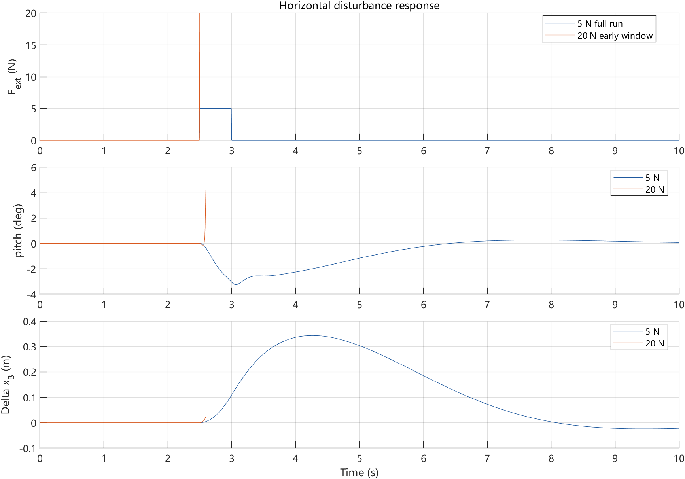

| case | parameter | sim | pass | v MAE (m/s) | peak wheel (m) | peak pitch (deg) | QP feasible | dyn residual |
|---|---|:---:|:---:|---:|---:|---:|---:|---:|
| disturbance_20N | 20 N, 2.5-3.0 s; early-response window | yes | no | 0.01102 | 0.05479 | 4.96 | 0.9923 | 5.420e-07 |
| disturbance_5N | 5 N, 2.5-3.0 s | yes | yes | 0.0713 | 0.03319 | 3.238 | 1 | 6.217e-14 |

5 N 脉冲完整恢复：最大 pitch 3.238°、最大位移 0.3435 m、恢复时间 6.695 s。

20 N 在施力后 0.1 s 内已达到 pitch 4.960°、速度 0.687 m/s，QP 可行率降至 99.232%；继续仿真进入极小步长而无法完成。该点判为强扰动失效，不提供恢复时间。

## 完成清单

- [x] 静态站立通过
- [x] pitch 扰动恢复通过
- [ ] 速度跟踪性能门槛通过
- [x] 非最小相位轮位反向运动验证
- [x] LQR 权重经验已记录
- [x] NMPC 权重经验已记录
- [x] 摩擦/力矩边界已记录
- [x] 外部扰动恢复/失效边界已记录
- [x] 自动报告已生成

结论只适用于严格共同模态。左右差动、接触不一致、单侧扰动和三维自由度应在后续完整双腿模型中另行验证。
